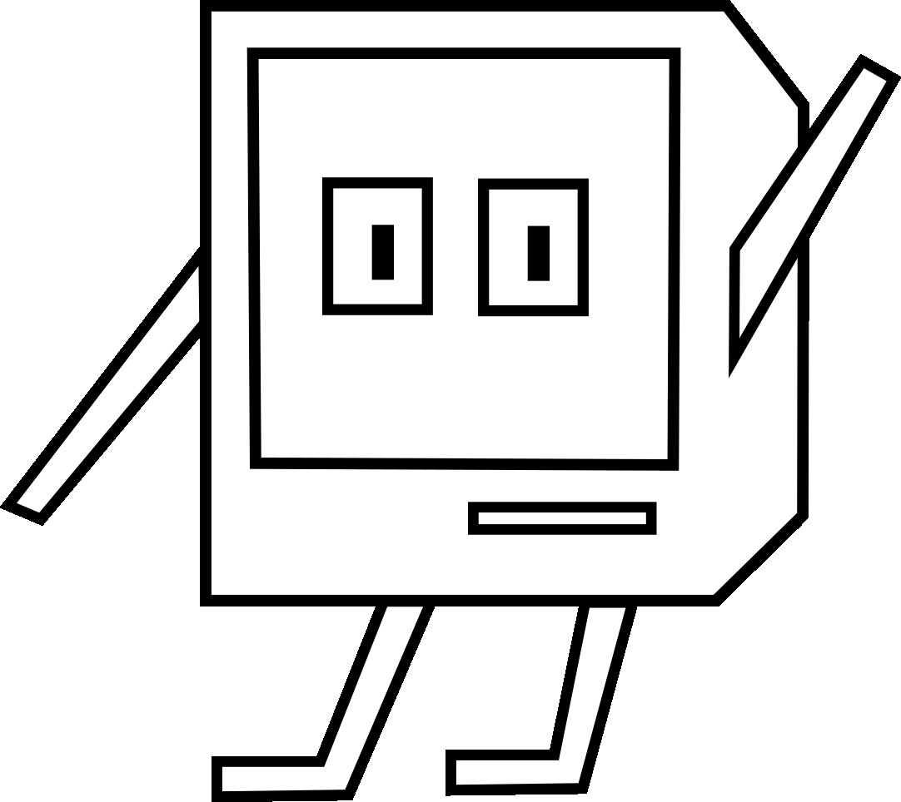

# GismoLang
The Gismo Programming Language.

This is the official logo of GismoLang:



These Creatures are called "Gizmos" and are representing the language.

### Build

With the help of make:
```bash
$ make gismo
```